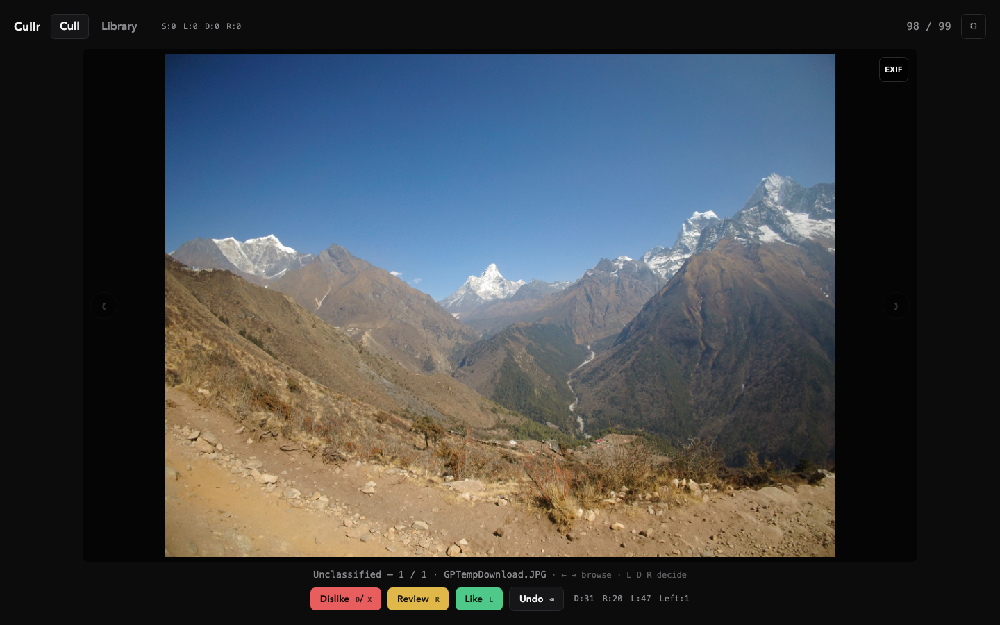
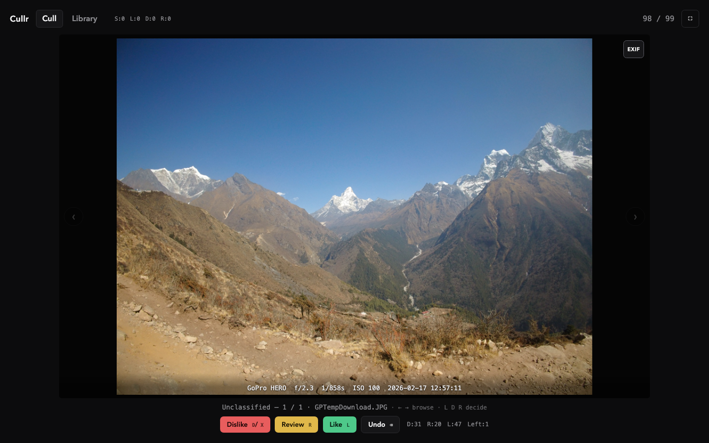
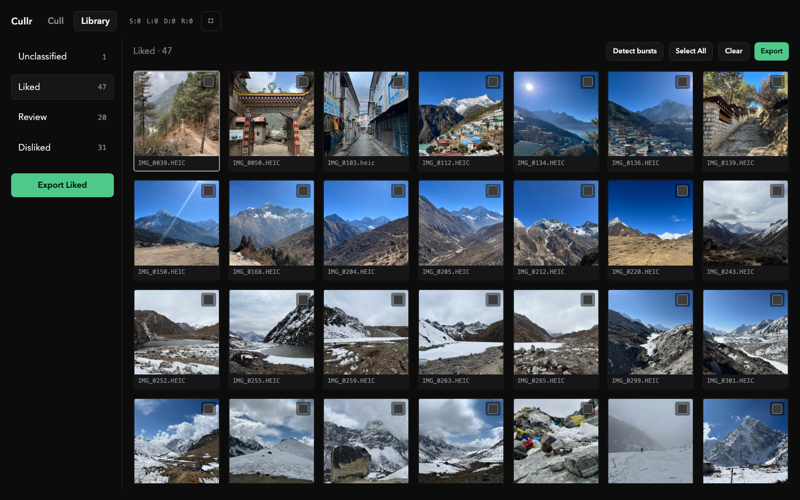
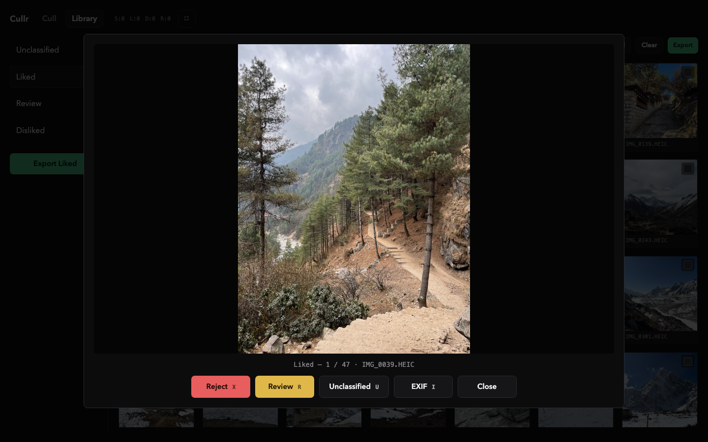
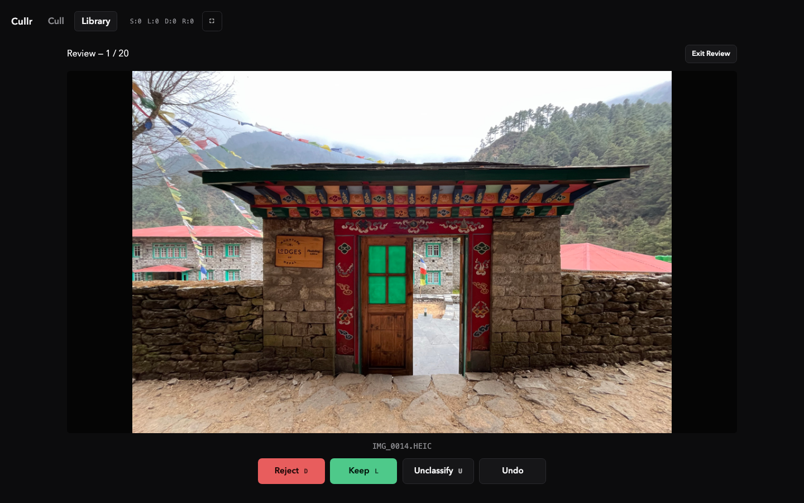
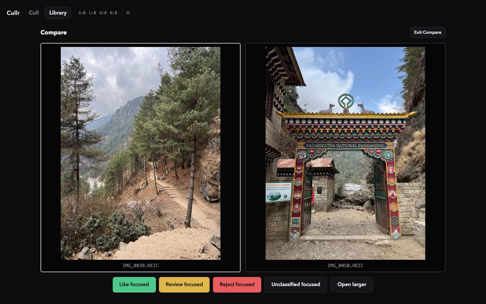

# Sorta

**Local-first photo culling for camera dumps.** Open a folder, decide Like / Dislike / Review at keyboard speed, and let the filesystem stay the source of truth. Photos never leave your machine — no accounts, no cloud upload, no database.

Sorta is a single Go binary that serves an embedded React UI on localhost. Classification is a real file move into `liked/`, `disliked/`, and `review/`.

---

## Screenshots

### Cull — one photo, one decision

Fast triage for unclassified shots. Browse with arrows; decide with `L` / `D` / `R`. Session counts stay visible so you always know what’s left.



Toggle on-demand EXIF (`I`) when you need camera / lens / exposure — it loads only when you ask, and resets when you move on.



### Library — browse by bucket

Grid of thumbnails per bucket (Unclassified, Liked, Review, Disliked). Multi-select, drag onto sidebar buckets, detect bursts, and export Liked when you’re done.



Open any photo for a larger viewer without leaving the library.



### Review — second pass

Walk the Review bucket Keep / Reject style when you’re ready for the maybes.



### Compare — pick a winner

Select two or more shots and compare side-by-side; actions apply to the focused frame.



---

## Modes at a glance

| Mode | Purpose |
|------|---------|
| **Cull** | One-at-a-time classify into liked / disliked / review. Fast path — no burst EXIF scan; display-sized previews. |
| **Library** | Grid by bucket; multi-select; drag/drop; compare. EXIF only when a photo is open and EXIF is on. **Detect bursts** scans capture times (≥3 frames within 1s). |
| **Review** | Keep / Reject pass over the Review bucket. |
| **Compare** | Side-by-side ranking for selected photos. |

---

## Quick start

```bash
./bin/sorta ~/Pictures/my-trip
```

The app listens on `127.0.0.1:8080` by default and opens your browser.

**Development** (two terminals):

```bash
go run ./cmd/sorta -no-open ~/Pictures/my-trip
cd web && npm install && npm run dev
```

**Rebuild** after Go or UI changes:

```bash
./scripts/build.sh
```

---

## Keyboard shortcuts

### Cull

| Key | Action |
|-----|--------|
| `←` `→` | Browse previous / next (no classify) |
| `L` | Like |
| `D` / `X` | Dislike |
| `R` | Review |
| `Backspace` / `⌘Z` | Undo |
| `F` | Fullscreen |
| `I` | EXIF overlay (full view; loads on demand) |

### Library

| Key | Action |
|-----|--------|
| Arrows | Move focus |
| `Space` | Toggle selection |
| `Enter` | Open viewer |
| `L` `D` `R` `U` | Move focused/selected → Liked / Disliked / Review / Unclassified |
| `X` | Quick reject → Disliked |
| `⌘A` | Select all |
| `F` | Fullscreen |
| `I` | EXIF overlay (viewer; on demand) |

Bulk moves (2+) ask for confirmation. Drag photos onto sidebar buckets.

---

## On-disk layout

```text
root/              unclassified (Cull queue + Library Unclassified)
liked/
review/
disliked/
.sorta/     session.json + preview cache (not scanned as photos)
```

Previews live under `.sorta/cache/` and are disposable. **Originals are never modified** — only moved between buckets (and optionally copied on Liked export).

---

## API (V1.5)

- `GET /api/photos` — Cull queue (no EXIF)
- `GET /api/library/{root|liked|review|disliked}` — photo list (no EXIF / burst scan)
- `POST /api/library/{bucket}/detect-bursts` — annotate EXIF times and group bursts
- `GET /photos/{file}` — cached viewer JPEG (~2048px); `?size=thumb` for grid (~480px)
- `GET /api/photos/{file}/exif?from=` — on-demand EXIF
- `GET /api/stats` · `GET|PUT /api/session`
- `POST /api/photos/{file}/action` · `POST /api/photos/move` · `POST /api/photos/move-bulk`
- `POST /api/photos/reset-unclassified` — move Liked / Review / Disliked back to Unclassified
- `POST /api/export/liked` — batch Liked into `batch-NNN/` folders (30 each), JPEG copies ≤15MB
- `POST /api/undo` — bulk undo restores the whole batch

---

## Tests

```bash
go test ./...
```

---

## Why Sorta

Photographers often dump hundreds of frames from a shoot and need a ruthless first pass before Lightroom or a gallery export. Sorta is that pass: keyboard-first, filesystem-honest, and fast enough that the photo — not the UI — stays in focus.
